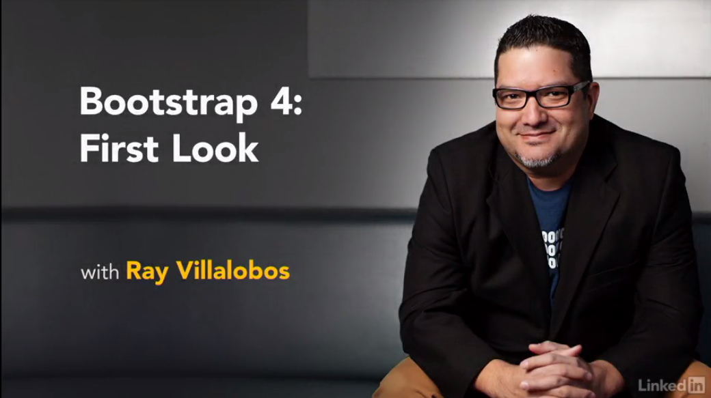

# Bootstrap 4: First Look
This is the repository for my course, [Bootstrap 4: First Look](http://www.lynda.com/Bootstrap-tutorials/Bootstrap-4-First-Look/372547-2.html). The full course is available at [lynda.com](http://lynda.com).
- [My Personal Website](http://raybo.org)

## Description
Bootstrap 4 is here, and it's an important update that touches nearly every line of code. Get your first look at the changes in this popular responsive design platform. Our resident Bootstrap expert Ray Villalobos covers Reboot.css, which standardizes a lot of the CSS in Bootstrap 4; the new card components; and changes to the grid, forms, and tables in Bootstrap. Plus, find out how to compensate for the deprecation of Glyphicons and adjust to smaller changes throughout the platform. These tips will help you avoid some of the pitfalls when it comes to upgrading your own site from Bootstrap 3 and get excited about what's to come.

### Topics include:
- Installing the upgrade
- Using Reboot.css
- Using the new grid
- Working with new navigation and card components
- Understanding table and form changes

## Instructions
This repository has branches for each of the videos in the course. You can use the branch pop up menu in github to switch to a specific branch and take a look at the course at that stage. Or you can simply add `/tree/BRANCH_NAME` to the URL to go to the branch you want to peek at.

1. Make sure you have these installed
	- [node.js](http://nodejs.org/)
	- [git](http://git-scm.com/)
	- [gulp](http://gulpjs.com/)
2. Clone this repository into your local machine using the terminal (mac) or Gitbash (PC) `> git clone https://github.com/planetoftheweb/bootstrap.git`
3. CD to the folder `cd bootstrap`
4. Run `> npm install` to install the project dependencies
5. Run `> gulp` command to start the automation
6. Build something awesome

For more help setting up a comprehensive Gulp.js workflow, check out [Web Project Workflows with Gulp.js, Git, and Browserify](http://www.lynda.com/Web-Web-Design-tutorials/Web-Project-Workflows-Gulpjs-Git-Browserify/154416-2.html).

## More Stuff
Check out some of my [other courses on lynda.com](http://lynda.com/rayvillalobos). You can also check out my [youtube channel](http://youtube.com/planetoftheweb), [follow me on twitter](http://twitter.com/planetoftheweb), or read [my blog](http://raybo.org).
